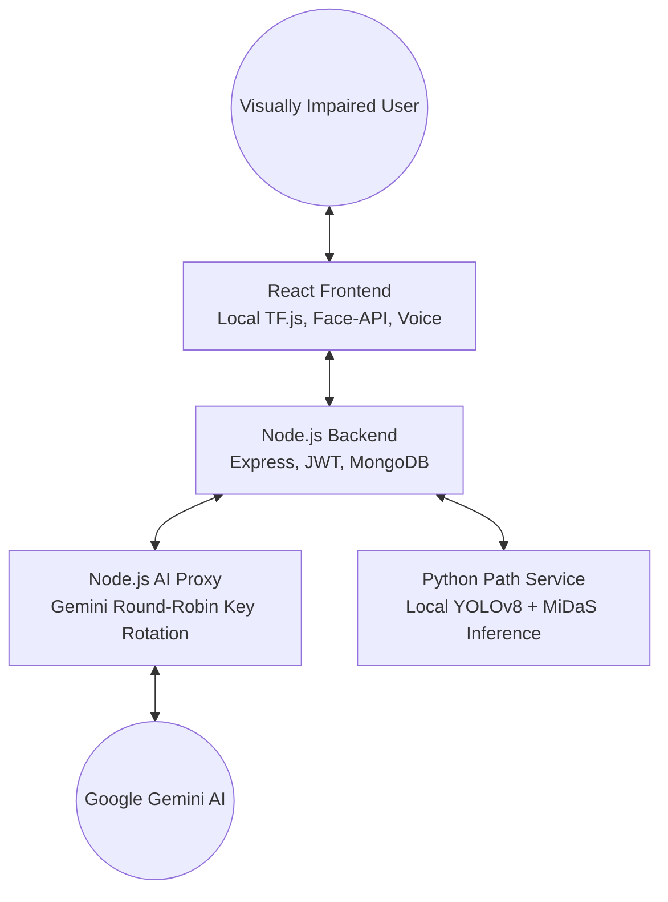

# Drishti: AI Visual Assistant for the Visually Impaired 👁️✨

> **Empowering 8M+ visually impaired individuals in India with real-time, AI-driven spatial awareness and intelligence.**

---

## 🌟 Overview

Drishti is a cutting-edge, cross-platform visual assistant designed to bridge the gap between technology and accessibility. In India alone, over 8 million people live with visual impairments, facing daily challenges in navigation and item identification. 

Drishti solves this by transforming a simple smartphone or laptop camera into a highly intelligent "Third Eye." It combines **offline computer vision**, **high-performance deep learning models**, and **multimodal Large Language Models (LLMs)** to provide continuous audio-guided awareness of the user's surroundings.

---

## ✨ Key Features

- 🔄 **Continuous Scanning Engine**: A hands-free recursive loop that analyzes the environment every 2-3 seconds, ensuring the user is always informed of their surroundings.
- 🎥 **Offline Object Detection**: Utilizes **COCO-SSD** to provide zero-latency identification of common objects (chairs, tables, bottles) with spatial positioning audio.
- 🧠 **AI Scene Description**: Leverages **Google Gemini** to generate rich, natural-language descriptions of complex scenes, extract text from documents, and identify currency.
- 🚶 **Real-time Path Guidance**: Integrates **YOLOv8** and **MiDaS** for spatial depth estimation, informing users of obstacles and clear paths (e.g., "Obstacle 1.5m ahead").
- 👤 **Face Recognition**: Powered by **face-api.js**, allowing users to enroll friends and family and identify them instantly through local biometric storage.
- 🎙️ **Voice Commands**: Full hands-free control via the **Web Speech API**. Support for "Continuous Mode" allows the app to listen indefinitely for commands.
- 🔒 **Secure History & Reports**: Personal dashboard to save analyses, view history, and generate shareable public reports for caregivers.
- 🔊 **Smart Speech Queue**: A robust service that prevents overlapping audio, ensuring every spoken instruction is clear and sequential.

---

## 🏗️ Architecture Overview

Drishti utilizes a modular microservices architecture to balance heavy ML computation with lightweight client-side responsiveness.



---

## 💻 Tech Stack

- **Frontend**: React 18, TypeScript, Vite, Tailwind CSS, TensorFlow.js, face-api.js, WebRTC, Web Speech API.
- **Backend**: Node.js, Express, MongoDB Atlas, Mongoose, JWT.
- **AI Proxy**: Node.js, Express, Multi-key load balancing logic.
- **Python ML Service**: Flask, PyTorch, Ultralytics YOLOv8, MiDaS, OpenCV.
- **LLM Infrastructure**: Google Gemini Pro (utilizing 5 separate API projects for resilience).

---

## 🚀 Setup Instructions

### 1. Prerequisites
- **Node.js 18+** & **npm**
- **Python 3.9+** (Standard desktop install)
- **MongoDB** (Atlas account or local instance)
- **Google Gemini API Keys** (at least 1, recommended 5 for rotation)

### 2. Service-Specific Setup

#### A. Python Path Service (Port 5003)
```bash
cd path-detection-service
pip install -r requirements_full.txt
# Note: models (~3.5GB) will download automatically on first run
python app_full.py
```

#### B. AI Proxy Service (Port 3001)
```bash
cd proxy
npm install
# Configure 5 API keys in .env
npm start
```

#### C. Backend API (Port 5002)
```bash
cd backend
npm install
# Set MONGO_URI and JWT_SECRET in .env
npm start
```

#### D. Frontend UI (Port 5173 / 5177)
```bash
cd frontend
npm install
npm run dev
```

> [!TIP]
> **Use Automation**: You can start the entire stack on Windows by simply double-clicking the `start_all.bat` script in the root folder!

---

## 🔑 Environment Variables

### Proxy (`proxy/.env`)
| Variable | Value |
| :--- | :--- |
| `PORT` | 3001 |
| `USE_MOCK_AI` | `false` |
| `GEMINI_API_KEY_1...5` | Your API keys |

### Backend (`backend/.env`)
| Variable | Value |
| :--- | :--- |
| `MONGO_URI` | `mongodb://...` |
| `JWT_SECRET` | Secret string |
| `PROXY_URL` | `http://localhost:3001` |
| `PATH_SERVICE_URL` | `http://localhost:5003` |

---

## 📖 Usage Guide

1. **Permission**: Grant Camera and Microphone access when prompted.
2. **Commands**: Tap the **Microphone** button or use the **Fallback Text Input**.
3. **Modes**: 
   - **Vision**: Standard recognition and AI description.
   - **Path**: Spatial distance estimation.
   - **Face**: Biometric identity tracking.
4. **Voice Controls**: 
   - "Start scanning" / "Stop scanning".
   - "Switch to Path mode".
   - "Capture once" or "What's in front of me?".


---

## 🛠️ Troubleshooting

- **503 Service Unavailable**: Ensure the Python Service is running on Port 5003. Check `python.log`.
- **Voice Network Error**: Ensure you are using `localhost` or `HTTPS`. If using Brave, enable "Google services for push messaging".
- **Empty Descriptions**: Check the Proxy logs to ensure your Gemini API keys are active and not rate-limited.

---

## 📄 License
Released under the **MIT License**. Created by team **Discrete Syndicates** – 2026.
