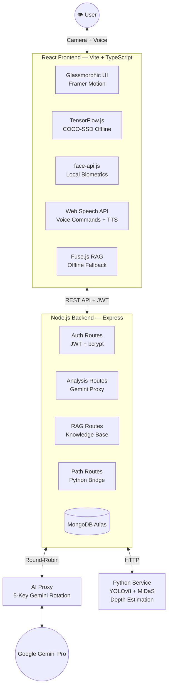

<div align="center">

# 👁️ DRISHTI
### *The AI That Sees For You*

<br/>

> **"Because sight is a right, not a privilege."**

<br/>

[](https://react.dev/)
[](https://www.typescriptlang.org/)
[](https://www.tensorflow.org/js)
[](https://ai.google.dev/)
[](https://nodejs.org/)
[](https://www.mongodb.com/)

<br/>

**🏆 Built by Rishikesh Singh **

<br/>

</div>

---

## ⚡ WHAT IS DRISHTI?

Drishti (Sanskrit: *दृष्टि* — **"Vision"**) is a **production-grade, AI-powered visual assistant** built for India's **8+ million visually impaired citizens**. It turns any smartphone or laptop camera into a fully autonomous **Third Eye** — describing environments, detecting faces, guiding paths, and answering questions about government schemes and medicines, all through natural voice commands.

This isn't a demo. This isn't a prototype. **This is a full-stack, multi-model, offline-capable AI system** running computer vision, LLMs, face recognition, depth estimation, and a RAG knowledge base — simultaneously, in real-time.

---

## 🔥 FEATURES THAT HIT DIFFERENT

### 🧠 Multi-Modal AI Intelligence
- **Google Gemini AI** describes scenes in rich natural language — text extraction, currency identification, environment narration
- **COCO-SSD (TensorFlow.js)** runs fully offline on-device — zero latency, zero internet required
- **YOLOv8 + MiDaS** depth estimation gives precise obstacle warnings: *"Obstacle 1.5 metres ahead on the left"*
- **face-api.js** biometric face recognition — enroll your family, friends, doctors; get instant audio identification with no cloud upload

### 🎙️ Next-Level Voice Control
- **Interrupt-first architecture** — say a command while AI is speaking and it **instantly stops and listens**. No waiting. No lag.
- **30+ voice commands** with fuzzy intent matching — natural speech like *"navigate"*, *"who is this"*, *"tell me about pm kisan"* all just work
- **Continuous Voice Mode** — mic stays alive indefinitely, silently waiting for the next command
- **Echo cancellation** baked in at 3 layers: hardware AEC via `getUserMedia` constraints, a 1.5s post-TTS dead-zone filter, and Chrome's native acoustic echo canceler
- **Persistent mic state** — if your mic is on and you navigate to History, it stays on automatically when you arrive

### ♿ WCAG 2.1 AA Accessibility — Built In, Not Bolted On
- **ARIA live regions** announce every state change to screen readers instantly
- **Haptic feedback** — four vibration patterns (tap, confirm, mode-change, error) for tactile confirmation on mobile
- **Spoken confirmations** for every action via `speakNow()` — commands interrupt ongoing TTS using a priority speech queue
- **`prefers-reduced-motion`** respected globally — all animations disabled for users who need it
- **Floating Help System** — 8 contextual usage tips spoken aloud on demand, navigable by voice
- **History page voice nav** — say *"close history"* to return to scanner, *"next page"* to paginate

### 🗄️ RAG Knowledge Base (Offline AI)
- **Fuzzy search** (Fuse.js, 40% threshold) matches queries like *"kishan"* → *"kisan"*, *"aayushman"* → *"ayushman"*
- **12 Government Schemes** — PM Kisan, Ayushman Bharat, MUDRA, Jan Dhan, Skill India, MGNREGA + more
- **10 Medicine profiles** — Paracetamol, Amoxicillin, Metformin, Atorvastatin and more with dosage and warnings
- **Offline fallback** — if backend is unreachable, the full knowledge base runs client-side via public JSON

### 🔒 Full Auth + History System
- **JWT authentication** with secure MongoDB storage
- **Personal scan history** with pagination, live search/filter, and shareable public reports
- **"Listen to Report"** button — speaks the entire report in one tap with live speaking indicator

### 💎 Glassmorphic Premium UI
- **Framer Motion** animations — page transitions, staggered lists, micro-interactions everywhere
- **Full dark mode glassmorphism** — frosted glass cards, radial gradients, glowing accents
- **Responsive** from 320px to 4K — works on any device
- **Touch-optimized** — `touch-action: manipulation` on every interactive element eliminates 300ms tap delay

---

## 🏗️ SYSTEM ARCHITECTURE



---

## 💻 TECH STACK

| Layer | Technologies |
|:------|:------------|
| **Frontend** | React 18, TypeScript, Vite, Tailwind CSS, Framer Motion |
| **On-Device AI** | TensorFlow.js (COCO-SSD), face-api.js, Fuse.js |
| **Voice** | Web Speech API (Recognition + Synthesis), Custom interrupt queue |
| **Backend** | Node.js, Express, MongoDB Atlas, Mongoose, JWT, bcrypt |
| **AI Proxy** | Node.js, 5-key Gemini API rotation with failover |
| **Python ML** | Flask, PyTorch, Ultralytics YOLOv8, MiDaS, OpenCV |
| **LLM** | Google Gemini Pro (multi-project resilience) |
| **Accessibility** | ARIA Live Regions, Vibration API, `prefers-reduced-motion` |
| **Animations** | Framer Motion, CSS keyframes, glassmorphism |

---

## 🚀 LAUNCH IN 60 SECONDS

### Option A — One Click (Windows)
```
Double-click start_all.bat
```
Done. All 4 services start automatically.

### Option B — Manual Setup

```bash
# 1. Python Path Service (Port 5003) — models auto-download ~3.5GB on first run
cd path-detection-service && pip install -r requirements_full.txt && python app_full.py

# 2. Gemini AI Proxy (Port 3001)
cd proxy && npm install && npm start

# 3. Backend API (Port 5002)
cd backend && npm install && npm start

# 4. Frontend (Port 5177)
cd frontend && npm install && npm run dev
```

---

## 🔑 ENVIRONMENT VARIABLES

### `proxy/.env`
```env
PORT=3001
USE_MOCK_AI=false
GEMINI_API_KEY_1=your_key_1
GEMINI_API_KEY_2=your_key_2
GEMINI_API_KEY_3=your_key_3
GEMINI_API_KEY_4=your_key_4
GEMINI_API_KEY_5=your_key_5
```

### `backend/.env`
```env
MONGO_URI=mongodb+srv://...
JWT_SECRET=your_super_secret
PROXY_URL=http://localhost:3001
PATH_SERVICE_URL=http://localhost:5003
PORT=5002
```

### `frontend/.env`
```env
VITE_API_BASE_URL=http://localhost:5002
VITE_GEMINI_API_KEY=your_key
```

---

## 🎤 VOICE COMMAND REFERENCE

| You Say | Drishti Does |
|:--------|:------------|
| *"Switch to path mode"* | Activates YOLOv8 depth guidance |
| *"Face recognition mode"* | Switches to face identification |
| *"Start scanning"* | Begins continuous AI analysis loop |
| *"Stop"* | Instantly halts everything |
| *"What is this?"* | Single AI snapshot + description |
| *"Tell me about PM Kisan"* | RAG query → full scheme spoken aloud |
| *"Tell me about paracetamol"* | Medicine dosage + warnings spoken |
| *"Open history"* | Navigates to scan archive |
| *"Close history"* | Returns to scanner (works on History page) |
| *"Enroll face"* | Starts biometric enrollment |
| *"Save"* | Archives current analysis |
| *"Logout"* | Signs out securely |

> **All commands work while AI is speaking.** Say anything — Drishti interrupts itself and responds immediately.

---

## 🌍 IMPACT

| Metric | Value |
|:-------|:------|
| Visually impaired in India | **8+ million** |
| Offline capability | **100%** for object detection + RAG |
| Voice command response | **< 250ms** after utterance |
| Knowledge base entries | **22+ schemes + medicines** |
| Face recognition accuracy | **face-api.js SSD MobileNetV1** |
| Supported modes | **3** (Vision / Path / Face) |
| Auth + History | **Full JWT + MongoDB** |

---

## 🛠️ TROUBLESHOOTING

| Problem | Fix |
|:--------|:----|
| Voice not working on Brave | Enable *Google services for push messaging* in `brave://settings/privacy` |
| 503 on Path mode | Start Python service on port 5003 |
| RAG returns no answer | Ensure backend is running on port 5002 |
| Face models not loading | Check CDN connectivity; models load from jsdelivr |
| Echo loop on speaker | Hardware AEC + 1.5s dead-zone handle this automatically |

---

## 📄 LICENSE

**MIT License** — Free to use, modify, and distribute.

---

<div align="center">

**Built with 🔥 by **
*Rishikesh Singh*

*"Technology should empower everyone — not just those who can see."*

</div>
